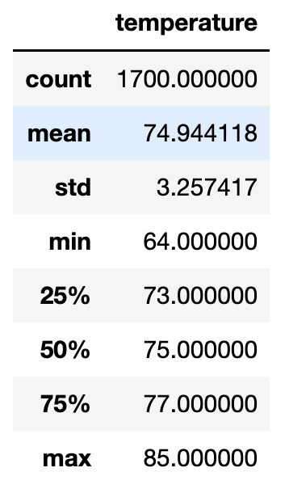
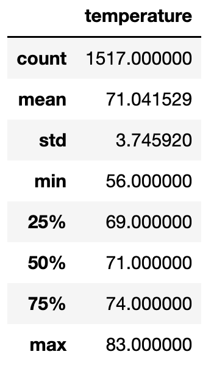
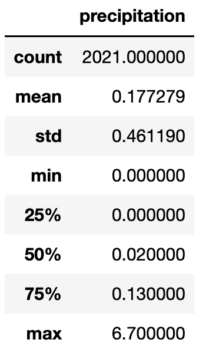

# Surfs Up
BC Mod09 - weather analysis

## Overview
This analysis explores the average temperatures in Oahu during the months of
June and December. The purpose for this analysis is to ensure that the weather
is amenable to opening a Surf and Shakes shop in Oahu and that such a business
could be sustained by year-round business based on a 'surfing and
ice-cream-eating temperature range.'

### Resources
Software: PythonData Dev Environment (Python 3.7.11), Jupyter Notebook 6.4.6  
Languages: Python, SQLite  
Dependencies: numpy, pandas, sqlalchemy (automap_base, session, create_engine,
func, extract)  
Data Source: hawaii.sqlite

## Results
The weather in Oahu is remarkably stable throughout the year. The temperature
does not flunctuate significantly. The following points bear mention:  
* The average temperature in June in the eight year period from 2010 to 2017 was 74.9 degrees.
  

* The average temperature in December in this same eight year period was 71.0 degrees.  
  

* While the average temperature was higher in June by approximately four degrees, the range was notably narrower. The standard deviation in temperature readings in June was 3.26 degrees. The recorded minimum temperature was 64 degrees. The recorded maximum was 85.

* The standard deviation of temperatures in December was 3.75 degrees, which follows from the wider range of temperatures in this month. The recorded minimum was 56 degrees, while the recorded maximum was 83.

## Summary
Overall, it seems apparent that the stability and range of the temperatures in
Oahu are conducive to a business venture that focuses on surfing and shakes /
ice cream.

While temperature is an important metric in determine whether the weather will
be conducive to such a shop, further analysis is warranted. Two further
inquiries would help to determine whether the weather will "cooperate" with this
venture.

The first additional inquiry that would prove valuable would be an analysis of
precipitation. Rain could cause challenges to the stream of business. The
following image from an analysis of the precipation indicates that this should
not be a problem. Approximately 75% of the days in the previous year, from Aug
2017, had less than 0.13 inches of precipitation.

The second additional inquiry, which has not been done to date, would be a
month-by-month analysis in order to determine whether certain months of the year
would have weather that was problematic. While year-round weather seems to be
fairly stable, any given month could have weather that affects the business.
This should be known prior to opening the shop in order to determine staffing
levels, optimal seasons for vacation or, conversely, for hiring additional
staff.
